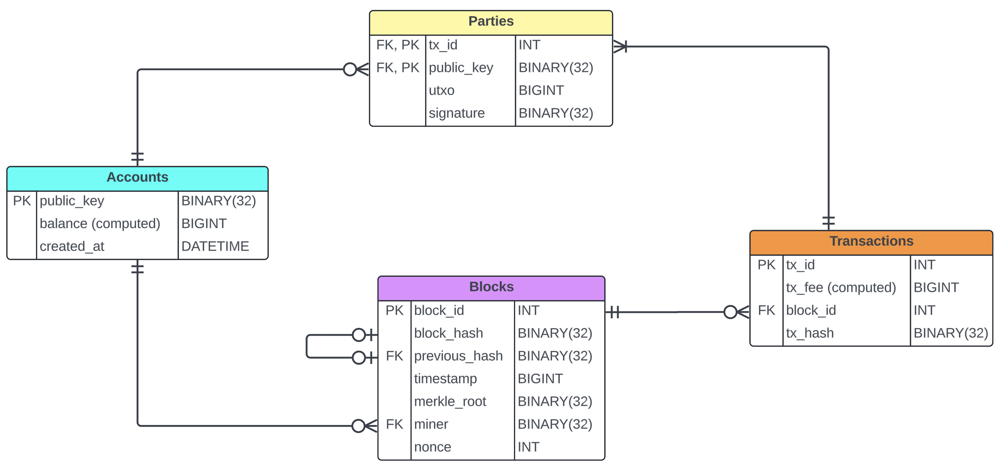

## Database Design

This database has four main tables and an extra table for blockchain parameters. Below is the Entity-Relationship Diagram (ERD): 

Following are the descriptions for the tables:

#### 1. **Blocks**
- Represents individual blocks in the blockchain.
- Each block links to the previous block via its `previous_hash`.
- Includes fields for block metadata like nonce, timestamp, and hash.

#### 2. **Accounts**
- Stores public keys for senders and receivers involved in transactions.
- **Note:** While Bitcoin does not store account balances directly, this table allows tracking balances like Ethereum. If you don’t want to store balances, this table is unnecessary and can be bypassed using public keys directly in the **Parties** table. 

#### 3. **Transactions** 
- This table records the transfer of value between accounts, like ACH transfers. 
- To mimic Bitcoin, each transaction can have multiple senders and multiple receivers. Thus, it has a many-to-many relationship with the **Accounts** table. 

#### 4. **Parties**
- It is the bridge table that establishes the many-to-many relationship between **Transactions** and **Accounts**.
- Tracks the amount (UTXO) associated with each party: Positive for receivers and Negative for senders.
- The sum of inputs can be equal to or greater than the sum of outputs. The extra amount is the fee (tip) that goes to the miner. 
 
#### 5. **Parameters**
- Contains blockchain constants and configurable values such as difficulty target, block reward, and other key protocol settings. 

---

## SQL Code Structure

This repository includes four SQL scripts to set up and operate the blockchain simulation. Execute them in the following order:

#### 1. `Protocol.sql`
- Creates the database tables, stored procedures, and functions.
- Enforces access controls to prevent unauthorized changes:
  - `UPDATE` and `DELETE` operations are disallowed.
  - Blocks and transactions can only be added through stored procedures.
  - New accounts and **Parties** records can be added using `INSERT`.
  - Two triggers secure data integrity in the **Parties** table.

#### 2. `Initialize.sql`
- Defines the mining procedure and creates the Genesis block.

#### 3. `Test.sql`
- Populates the database with test accounts and transactions. 
- Mines a few blocks to demonstrate functionality. 
- Can be customized to create additional transactions or blocks. 

#### 4. `Reset.sql` 
- Resets the database by removing all tables and data.
- You can start over by re-running `Protocol.sql` and `Initialize.sql`.

---

## Contribution Guidelines

We welcome contributions to improve the codebase or documentation. Here are the steps to make contributions: 

1. **Fork the Repository**  
   Create a personal copy of the repository to make changes.

2. **Modify**  
   Make changes in your local.

3. **Testing**  
   Test in your local and ensure your changes pass all relevant tests.

4. **Submit a Pull Request**  
   Once changes are complete, submit a pull request for review. 
- **Note:** Discuss significant changes with the repository admin, Dr. Armani, before submitting a PR. Minor bug fixes or corrections do not require prior discussion though.

---

## License

This project is licensed under the **MIT License**, ensuring open use with attribution.

Feel free to suggest additional improvements, fork the repository, and experiment with this blockchain simulation!

